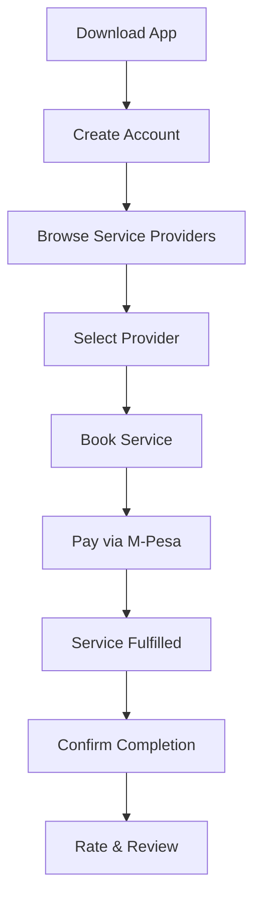
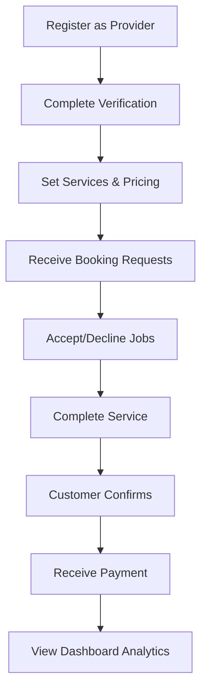

# MJOBA App Documentation

<div align="center">
  
  
  
  
  
  <p>Connecting urban Kenyans with verified local service providers</p>
  
  
</div>

##  Overview

MJOBA is a marketplace app that bridges the gap between urban Kenyan customers and local service providers. Operating in busy urban centers like Gikomba, Toi Market, Nairobi CBD, and Lavington, the app provides instant access to verified service professionals including:

- Beauticians
- Plumbers
- Electricians  
- Cobblers
- And more local services

## 🛠️ Technical Architecture

<div align="center">
  <table>
    <tr>
      <th>Component</th>
      <th>Technologies</th>
    </tr>
    <tr>
      <td>Frontend</td>
      <td>
        
        
      </td>
    </tr>
    <tr>
      <td>Backend</td>
      <td>
        
        
      </td>
    </tr>
    <tr>
      <td>Database</td>
      <td>
        
      </td>
    </tr>
    <tr>
      <td>Authentication</td>
      <td>
        
        
      </td>
    </tr>
    <tr>
      <td>Maps & Location</td>
      <td>
        
      </td>
    </tr>
    <tr>
      <td>Payments</td>
      <td>
        
      </td>
    </tr>
    <tr>
      <td>Notifications</td>
      <td>
        
      </td>
    </tr>
  </table>
</div>

##  Key Features

<div align="center">
  <table>
    <tr>
      <td align="center" width="20%">
        
        <p>Book immediately or schedule services for later</p>
      </td>
      <td align="center" width="20%">
        
        <p>Secure M-Pesa transactions with funds held until job completion</p>
      </td>
      <td align="center" width="20%">
        
        <p>All service providers are vetted and verified</p>
      </td>
      <td align="center" width="20%">
        
        <p>Quality assurance through customer feedback</p>
      </td>
      <td align="center" width="20%">
        
        <p>Earnings tracking and job management</p>
      </td>
    </tr>
  </table>
</div>

## 🔄 App Workflow

### Customer Journey



### Provider Journey



##  Business Model

<div align="center">
  <table>
    <tr>
      <th>Revenue Stream</th>
      <th>Description</th>
    </tr>
    <tr>
      <td>Commission</td>
      <td>10% fee on each successful service transaction</td>
    </tr>
    <tr>
      <td>Provider Subscriptions</td>
      <td>Optional premium tiers for increased visibility and features</td>
    </tr>
    <tr>
      <td>Boosted Listings</td>
      <td>Paid promotion to appear at top of search results</td>
    </tr>
  </table>
</div>

##  Security Features

- **Secure Payments**: M-Pesa integration with escrow functionality
- **Identity Verification**: Multi-step provider verification process
- **User Authentication**: Firebase Authentication with phone verification
- **Data Protection**: Secure credential storage and encryption
- **Transaction Monitoring**: Automated flagging of suspicious activities

## 📊 Market Impact

MJOBA aims to digitize Kenya's informal economy by:

- Providing local service providers access to wider urban markets
- Building trust through verified profiles and customer reviews
- Creating consistent income opportunities for skilled workers
- Offering convenient, secure service bookings for urban residents

## 🚀 Roadmap

### MVP (Current Focus)
- Core booking functionality
- M-Pesa payment integration
- Provider verification system
- Rating and review system
- Basic provider dashboards

### Future Expansions
- Service categories expansion
- In-app messaging
- Loyalty rewards program
- Advanced analytics for providers
- Subscription tiers and premium features

##  Implementation Details

### Architecture
MJOBA follows the MVVM (Model-View-ViewModel) architecture pattern:

```
app/
├── data/
│   ├── repository/    # Data repositories
│   ├── model/         # Data models
│   └── remote/        # API services (Firebase, M-Pesa)
├── domain/
│   ├── usecase/       # Business logic
│   └── model/         # Domain models
├── presentation/
│   ├── ui/            # Screens and components
│   ├── viewmodel/     # ViewModels
│   └── navigation/    # Navigation components
└── util/              # Utility classes
```

### Key Dependencies

- **UI**: Jetpack Compose, Material Design Components
- **Navigation**: Jetpack Navigation Compose
- **Networking**: Retrofit, OkHttp
- **Async**: Kotlin Coroutines, Flow
- **DI**: Hilt
- **Database**: Firebase Firestore
- **Maps**: Google Maps Compose
- **Payments**: M-Pesa Daraja SDK
- **Analytics**: Firebase Analytics
- **Testing**: JUnit, Espresso, Mockito

##  Screen Showcase

<div align="center">
  <table>
    <tr>
      <td align="center" width="33%">
        <strong>Registration</strong><br>
        
      </td>
      <td align="center" width="33%">
        <strong>Home Screen</strong><br>
        
      </td>
      <td align="center" width="33%">
        <strong>Location Search</strong><br>
        
      </td>
    </tr>
    <tr>
      <td align="center" width="33%">
        <strong>Booking Summary</strong><br>
        
      </td>
      <td align="center" width="33%">
        <strong>Provider Services</strong><br>
        
      </td>
      <td align="center" width="33%">
        <strong>Provider Dashboard</strong><br>
        
      </td>
    </tr>
  </table>
</div>

##  Target Audience

### Customers
- Urban residents in Nairobi
- Time-conscious professionals
- People seeking verified service providers

### Service Providers
- Skilled workers in various trades
- Small business owners
- Individual service professionals

##  Contact & Support

For technical support or feature requests:
- Email: support@mjoba.com
- In-app feedback form
- GitHub issues (for developers)

---

<div align="center">
  <p>MJOBA: Connecting Service Needs with Verified Providers</p>
  <p><small>© 2025 MJOBA. All rights reserved.</small></p>
</div>
